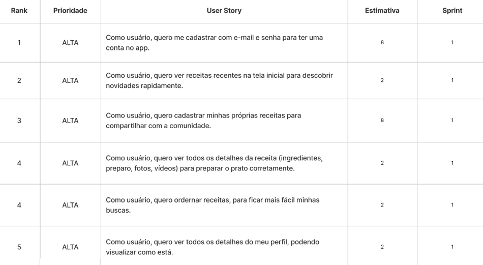

<div align="center">
  <h1>One-Plate</h1>
</div>

## 🖥️ Descrição

O One-Plate é um aplicativo de gerenciamento de receitas culinárias, desenvolvido para facilitar a organização e o acesso às suas receitas favoritas em um só lugar.

---

## 📖 Backlog do Produto


---

## 📅 Sprints

**Sprint 1**: 

**Sprint 2**: 🚧 Em andamento 🚧

**Sprint 3**: 🚧 Em andamento 🚧

---

## 🛠️ Tecnologias

### 📱 Mobile
- [React Native](https://reactnative.dev/) para construir a interface do aplicativo.
- [TypeScript](https://www.typescriptlang.org/) para garantir a tipagem estrita e a robustez do código.
- [Expo](https://expo.dev/) para facilitar o desenvolvimento e a distribuição do aplicativo.
- [GlueStack UI](https://glue-stack.com/) para criar componentes de interface consistentes e estilizados.

### 📟 Servidor
- [Fastify](https://fastify.dev/) para construir o servidor.
- [TypeScript](https://www.typescriptlang.org/) para garantir a tipagem estrita e a robustez do código.
- [Prisma](https://www.prisma.io/) para gerenciar o banco de dados.

### 📦 Banco de Dados
- [PostgreSQL](https://www.postgresql.org/) para o banco de dados.

---

<!-- ## 📁 Estrutura do Repositório

O projeto segue uma arquitetura de microserviços com separação clara de
responsabilidades:

- **`one-plate-server/`**: API REST desenvolvida em NestJS que gerencia e criptografia as senhas,notas seguras e usuarios.
- **`one-plate-mobile/`**: Aplicativo mobile desenvolvida com Expo.
- **`documentation/`**: Documentação técnica e relatórios de progresso do
  projeto

--- -->

<!-- ## 🚀 Instalação

Para configurar e executar o projeto localmente, siga estas etapas:

### Pré-requisitos

Certifique-se de ter instalado:
- Node.js
- Yarn ou npm
- PostgreSQL

### Passos

1. Clone o repositório:
   ```bash
   git clone https://github.com/kaufon/enigma.git
   ```
2. Configuracao do servidor:
   <br/>
   2.1 Instale as dependencias
  ```bash
    cd enigma-server/
    npm install
   ``` 
  2.2 Configure as variaveis ambientes
  ```bash
    cp .env.example .env
   ```
  2.3 Inicie o container docker
  ```bash
    docker compose up -d &&
    npx prisma migrate dev
   ```
  2.4 Inicie o servidor
  ```bash
    npm run start:dev
   ```
3. Configuracao do mobile:
   <br/>
  3.1 Instale as dependencias
  ```bash
    cd enigma-mobile/
    npm install
   ```
  3.2 Configure as variaveis ambientes
  ```bash
    cp .env.example .env
   ```
  3.3 Inicie a aplicacao
  ```bash
    npm run start
   ```

--- -->

## 👨‍💻 Autor

<div align="center">
   
</div>
 
### Gabriel da Silva Oliveira

> Estudante de Desenvolvimento de Sistemas Multiplataforma na [Fatec](https://fatecsjc-prd.azurewebsites.net/)

- <a href="https://github.com/Tico1606"></a>  

- <a href="linkedin.com/in/gabriel-oliveira-884ba5282/"></a>
